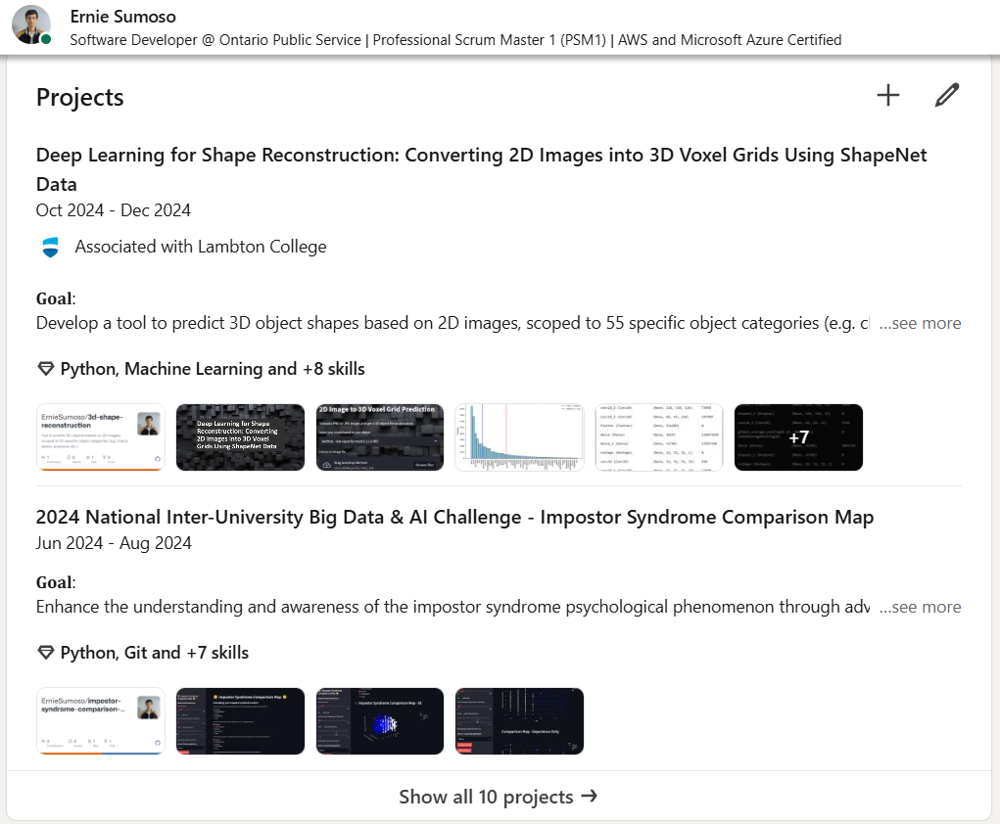

<a name="readme-top"></a>

<!-- PROJECT LOGO -->
<br />
<div align="center">
  <a href="https://github.com/ErnieSumoso/linkedin-projects-showcase">
    
  </a>

<h3 align="center">LinkedIn Projects Showcase Repository</h3>
  I utilize this repository to store the most relevant visualizations derived from my past projects, ensuring a refined showcase of my work on the LinkedIn platform.
  The primary objective of this repository is personal, aimed at maintaining a high-quality display of my projects.
  I plan to continuously add new files based on both ongoing and completed projects.
</div>


## About The Project

<div align="center">
  
</div>
This repository was created with the sole purpose of ensuring high-quality images on the LinkedIn platform, particularly within the profile's Projects section.
It serves as a centralized hub for the most relevant visualizations from my recent projects.
Please feel free to explore the pictures and my LinkedIn profile.
<h4 align="center">
  <code> <a href="https://www.linkedin.com/in/ernie-sumoso" title="LinkedIn">  My LinkedIn </a> </code>
</h4>

<p align="right">(<a href="#readme-top">back to top</a>)</p>


## Getting Started

There are no prerequisites, this is just a repository containing images and visualizations.

### Installation

1. Clone the repo
   ```sh
   git clone https://github.com/ErnieSumoso/linkedin-projects-showcase.git
   ```
2. Explore the files and enjoy!

<p align="right">(<a href="#readme-top">back to top</a>)</p>


## Usage

You can use this repository as an example to create your own centralized repository for project visualizations!

<p align="right">(<a href="#readme-top">back to top</a>)</p>


## Roadmap

- [ ] Update the repository for every on-going and finished project

I am always open for any suggestions on how to improve the repository structure. Please add them [here](https://github.com/ErnieSumoso/linkedin-projects-showcase/issues)!

<p align="right">(<a href="#readme-top">back to top</a>)</p>

<!-- CONTACT -->
## Contact

Ernie Sumoso - [GitHub Profile](https://github.com/ErnieSumoso) - [My Repositories](https://github.com/ErnieSumoso?tab=repositories)

Project Link: https://github.com/ErnieSumoso/linkedin-projects-showcase
